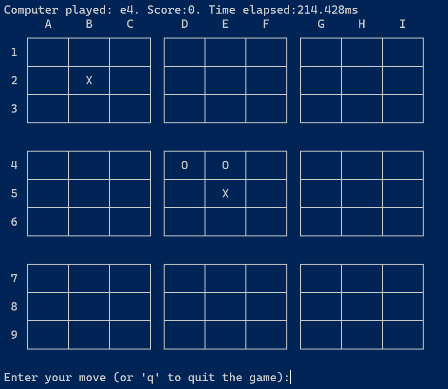

# Ultimate Tic Tac Toe
[Ultimate Tic Tac Toe game](https://en.wikipedia.org/wiki/Ultimate_tic-tac-toe) implemented in Go.

# How to run

Install Go compiler toolset. In the main directory, run

```
go run .
```
# How to play

Each move is a two-character string, a letter 'a' to 'i' followed by a number 1 to 9. For example: 'e5' is the center square.

Follow the rules of the game (see Wikipedia link above)


